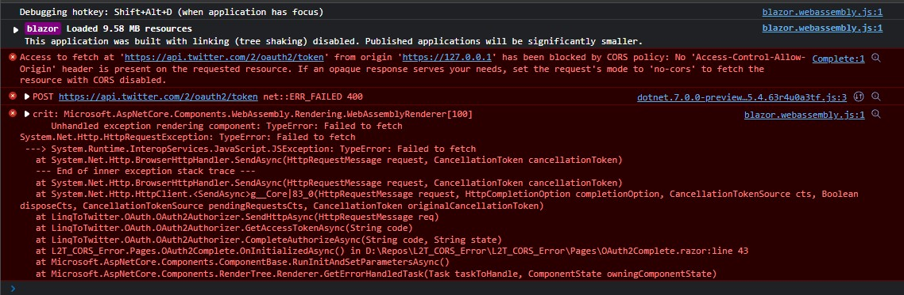
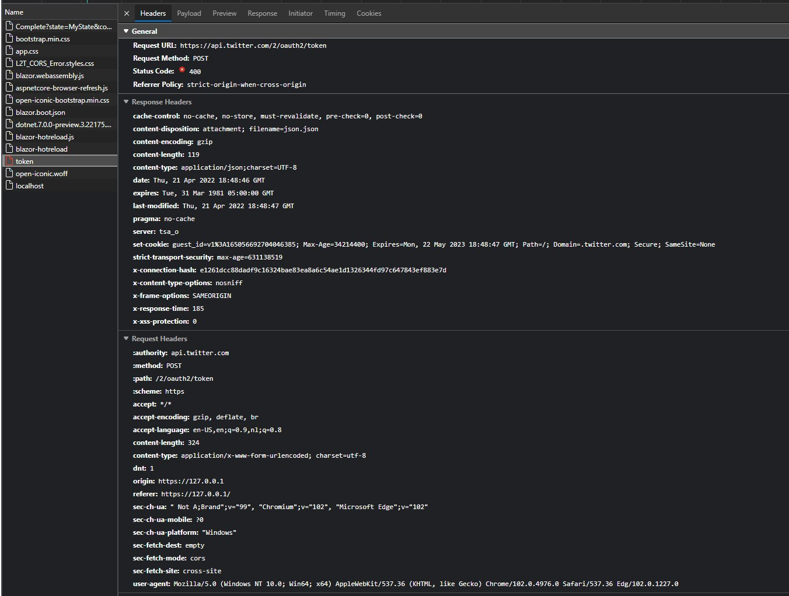

# L2T_CORS_Error

Begin / Complete

From the Twitter documentation [How to connect to endpoints using OAuth 2.0 Authorization Code Flow with PKCE](https://developer.twitter.com/en/docs/authentication/oauth-2-0/user-access-token)

* Steps to connect using OAuth 2.0
* Step 2: GET oauth2/authorize
* An example URL with offline_access would look like this:
  * `https://twitter.com/i/oauth2/authorize?response_type=code&client_id=M1M5R3BMVy13QmpScXkzTUt5OE46MTpjaQ&redirect_uri=https://www.example.com&scope=tweet.read%20users.read%20follows.read%20offline.access&state=state&code_challenge=challenge&code_challenge_method=plain`

To run this sample:

Twitter Project Settings / User authentication settings:

* OAuth 2.0: True / On
* Type of App: Single page App
* Callback URI / Redirect URL = "https://127.0.0.1/OAuth2/Complete";

In Pages/Index.razor

Fill in your `Client_Id` (_from Twitter_)

```
Access to fetch at 'https://api.twitter.com/2/oauth2/token' from origin 'https://127.0.0.1' has been blocked by CORS policy: No 'Access-Control-Allow-Origin' header is present on the requested resource. If an opaque response serves your needs, set the request's mode to 'no-cors' to fetch the resource with CORS disabled.

POST https://api.twitter.com/2/oauth2/token net::ERR_FAILED 400

crit: Microsoft.AspNetCore.Components.WebAssembly.Rendering.WebAssemblyRenderer[100]
Unhandled exception rendering component: TypeError: Failed to fetch
System.Net.Http.HttpRequestException: TypeError: Failed to fetch
 ---> System.Runtime.InteropServices.JavaScript.JSException: TypeError: Failed to fetch
   at System.Net.Http.BrowserHttpHandler.SendAsync(HttpRequestMessage request, CancellationToken cancellationToken)
   --- End of inner exception stack trace ---
   at System.Net.Http.BrowserHttpHandler.SendAsync(HttpRequestMessage request, CancellationToken cancellationToken)
   at System.Net.Http.HttpClient.<SendAsync>g__Core|83_0(HttpRequestMessage request, HttpCompletionOption completionOption, CancellationTokenSource cts, Boolean disposeCts, CancellationTokenSource pendingRequestsCts, CancellationToken originalCancellationToken)
   at LinqToTwitter.OAuth.OAuth2Authorizer.SendHttpAsync(HttpRequestMessage req)
   at LinqToTwitter.OAuth.OAuth2Authorizer.GetAccessTokenAsync(String code)
   at LinqToTwitter.OAuth.OAuth2Authorizer.CompleteAuthorizeAsync(String code, String state)
   at L2T_CORS_Error.Pages.OAuth2Complete.OnInitializedAsync() in D:\Repos\L2T_CORS_Error\L2T_CORS_Error\Pages\OAuth2Complete.razor:line 43
   at Microsoft.AspNetCore.Components.ComponentBase.RunInitAndSetParametersAsync()
   at Microsoft.AspNetCore.Components.RenderTree.Renderer.GetErrorHandledTask(Task taskToHandle, ComponentState owningComponentState)
```


```
General

Request URL: https://api.twitter.com/2/oauth2/token
Request Method: POST
Status Code: 400 
Referrer Policy: strict-origin-when-cross-origin

Response Headers

cache-control: no-cache, no-store, must-revalidate, pre-check=0, post-check=0
content-disposition: attachment; filename=json.json
content-encoding: gzip
content-length: 119
content-type: application/json;charset=UTF-8
date: Thu, 21 Apr 2022 18:20:50 GMT
expires: Tue, 31 Mar 1981 05:00:00 GMT
last-modified: Thu, 21 Apr 2022 18:20:51 GMT
pragma: no-cache
server: tsa_o
set-cookie: guest_id=v1%3A165056525108332651; Max-Age=34214400; Expires=Mon, 22 May 2023 18:20:51 GMT; Path=/; Domain=.twitter.com; Secure; SameSite=None
strict-transport-security: max-age=631138519
x-connection-hash: 751182134f5d5d7c35fa1f6dd10802838a0c93b74409bb21bc8fc75b0417c175
x-content-type-options: nosniff
x-frame-options: SAMEORIGIN
x-response-time: 214
x-xss-protection: 0

Request Headers

:authority: api.twitter.com
:method: POST
:path: /2/oauth2/token
:scheme: https
accept: */*
accept-encoding: gzip, deflate, br
accept-language: en-US,en;q=0.9,nl;q=0.8
content-length: 324
content-type: application/x-www-form-urlencoded; charset=utf-8
dnt: 1
origin: https://127.0.0.1
referer: https://127.0.0.1/
sec-ch-ua: " Not A;Brand";v="99", "Chromium";v="102", "Microsoft Edge";v="102"
sec-ch-ua-mobile: ?0
sec-ch-ua-platform: "Windows"
sec-fetch-dest: empty
sec-fetch-mode: cors
sec-fetch-site: cross-site
user-agent: Mozilla/5.0 (Windows NT 10.0; Win64; x64) AppleWebKit/537.36 (KHTML, like Gecko) Chrome/102.0.4976.0 Safari/537.36 Edg/102.0.1227.0
```

